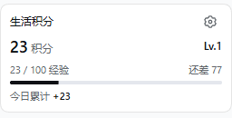

# dsh-points-mall

DSH Desktop 的生活积分插件：在对话列表下方、用量卡片上方显示积分余额、等级、升级进度和今日累计积分，并通过当前对话记账。

首版适配 **DSH 0.2.0-rc.2**。客户端使用 DSH 提供的 React 18 和主题，账本保存在本机。



截图为独立测试账本的示例数据。

## 安装

在 DSH 的插件管理页面安装 `github:ReturnDM/dsh-points-mall`，然后启用 `dsh-points-mall`。仓库附带构建产物，使用者无需自行编译。

也可使用 Desktop 附带的 `dsh` 命令安装。**先完全退出 Desktop**，然后执行：

```powershell
dsh plugin --profile desktop add github:ReturnDM/dsh-points-mall
```

这里的 `dsh` 必须是 Desktop 附带的 CLI，不能用另一版本的全局 npm CLI 修改 desktop profile。如果命令未加入 PATH，可使用 Desktop 安装目录下的 `resources/runtime/cli/bin/dsh.cmd`。

再次打开 Desktop，在插件管理中启用插件。点击侧栏的「设置积分账本」，选择：

- **新建账本**：默认建在当前 DSH Home 的 `points-mall/data`，提供通用示例事项与奖励券。
- **连接已有账本**：选择包含 `ledger/`、`tasks.json`、`shop.json` 和 `积分规则.md` 的数据目录。连接前只读验证，不修改原有规则。

首次设置不需要 Jev key。未配置账本时，插件显示设置入口。

## 对话记账

在对话中明确告诉当前模型已完成的事项，例如：

> 我完成了半小时阅读，按积分规则记一笔。

模型通过插件工具读取实际规则和近期流水，再记录奖励。固定事项使用固定分值，未定价事项由当前 DSH 模型根据规则判断，并在备注中保留依据。积分不会按消息数或 token 数自动产生。

其他例子：

- 「查看我的积分和最近十笔流水。」
- 「刚才那笔重复了，撤销它。」
- 「用积分兑换一张休息券。」
- 「我已经用了这张券，帮我核销。」

工具包括 `points_mall_summary`、`points_mall_rules`、`points_mall_list`、`points_mall_earn`、`points_mall_adjust`、`points_mall_redeem`、`points_mall_use`、`points_mall_recycle`、`points_mall_doctor`、`points_mall_judge`。插件自带 `points-mall` 技能，无需另行复制技能文件。

## 计分与数据

- 获得积分同时增加等量经验。消费不扣经验。
- 升到下一级需要 `100 + 10 × (当前等级 − 1)` 经验。
- 今日累计按设置的时区计算：统计今日获得记录经更正后仍有效的积分。更正昨日奖励不会算作今日奖励。
- 券回收按有效实付积分的 80% 向下取整，回收不增加经验或今日奖励。
- 每笔流水独立保存为 `ledger/YYYY-MM/*.json`。历史记录通过追加更正处理，写入使用文件锁及临时文件原子重命名。
- 写工具支持 `idempotencyKey`，同一操作重试使用同一标识可防止重复入账。新记录的标题、引用、商品 ID 和备注按首尾空白归一化后比对，备注内部格式保留；相同标识用于不同请求时会拒绝。旧版指纹保留精确原参数重试兼容，不改写历史。
- 支持原生活积分商城的 v1 流水和递归目录结构。坏文件和无效引用会阻止写账，`doctor` 只读报告问题。

请备份自己的数据目录。关闭或卸载插件后，数据目录仍保留。首版不包含完整商城网页。

窗口可见且消息流连通时，卡片在插件成功写账后及时刷新；窗口重新可见或聚焦时也会刷新。可见时每 30 秒读取一次，隐藏到后台时暂停；消息流断线或外部 CLI 写账时，通过兜底轮询或聚焦刷新恢复。流水、自检等组合查询使用同一份读取结果派生摘要。

## 可选 Jev 复核

在插件设置中保存 TypeSafe key 并启用 Jev 后，可以复核模型建议的分值。key 使用 DSH 凭据服务中的 `DSH_POINTS_MALL_JEV_KEY` 保存，不写入账本或普通插件配置，也不会回传给客户端。事项、积分规则和固定分值仅在启用并调用复核工具时发送到 TypeSafe。

复核只提供建议，写账仍由积分工具执行。关闭、缺 key、超时或请求失败时返回降级提示，由当前模型继续按规则判断；备注应标明未经 Jev 复核。API 使用 [TypeSafe 官方 HTTP 合约](https://docs.typesafe.ai/api)。

## 开发

```powershell
npm ci
npm run check
npm pack
```

使用 Node.js 22.19+ 或 24+。Host 与客户端分开打包：`lib/index.js` 是 Host ESM，`lib/client.js` 是 DSH ModuleLoader 的工厂，React 保持宿主外部依赖。

本地开发可在完全退出 Desktop 后，用其附带 CLI 将本目录以 `link:` 安装到 desktop profile。优先使用独立 DSH Home 进行测试，测试只写临时账本。

侧栏正式扩展槽目前不能保证两张卡片的垂直顺序，因此插件使用独立可清理容器，检测 `[data-dsh-usage-foot-card]` 并插入其上方。未装用量插件时显示在设置区域上方。将来的 DSH 或用量插件 DOM 变化可能需要调整挂载适配。

MIT License。
